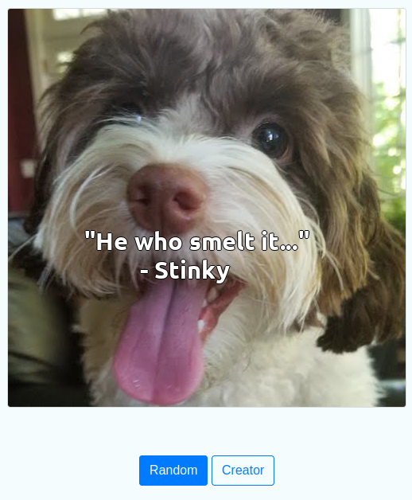
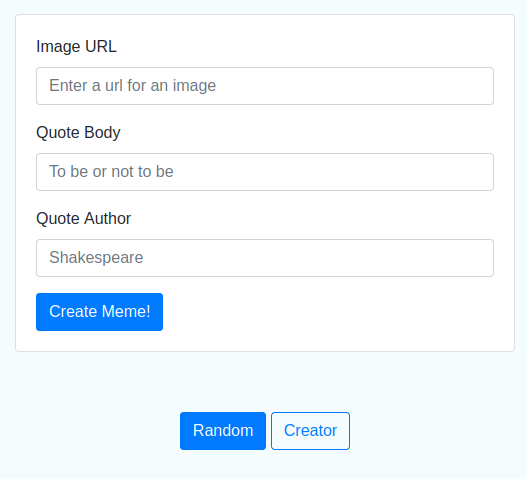
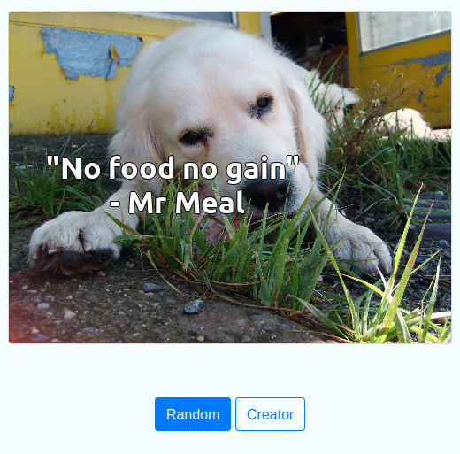

# Meme Generator Project


A meme generator application as a web app that dynamically generates memes by overlaying a quote on an image. 

This project is part of the Udacity Intermediate Python Nanodegree Program.
Please contact Udacity regarding copyright or license. 


## Installation 

First clone this repository and then install the dependencies. I used Python version 3.9.0 and I recommend installing the the dependencies into a new conda environment or virtualenv environment. 

```bash
git clone https://github.com/karinpietruska/meme-generator.git
pip install -r requirements.txt

```

## How to use 

From within the src folder run the app.py

```bash
python3 app.py

```

Then open the link that appears in the terminal. 
You will see a randomly generated meme similar to the following picture. 

<p align="center">
</p>


You have the choice of randomly generating another meme, by clicking the "Random" button below the image. Alternatively you can create or own meme by clicking on the "Creator" button. 
This opens the following template and you are asked to enter the image url, meme text and meme author. 

<p align="center">
</p>

For instance, I used the free to use dog picture in the following link: 
https://libreshot.com/wp-content/uploads/2014/01/white-dog-eats.jpg

With the text as displayed in the output below. 

<p align="center">
</p>

Then click the "Create Meme!" button and you see the created meme image: 

<p align="center">
</p>